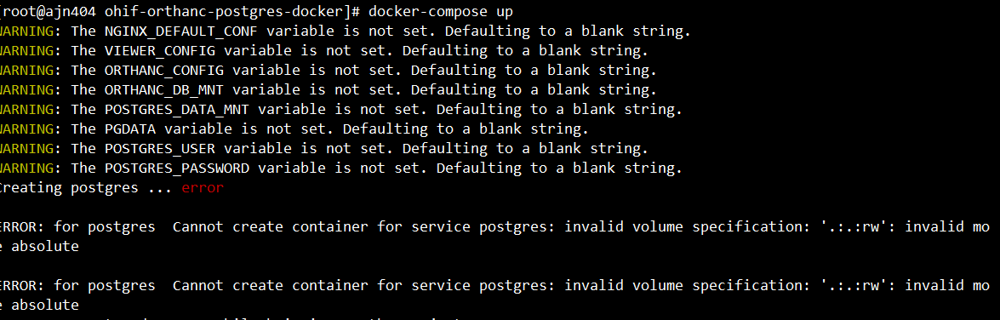
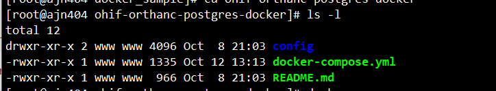

# NGINX + OHIF + Orthanc

Docker based infrastructure for OHIF Viewer, Orthanc (with postgres)
=======

这里所依赖的镜像版本
- ohif/viewer:v3.7.1.10058
- osimis/orthanc:20.2.0
- postgres:12.1

运行

```
docker -compose up
//后台运行
docker -compose up -b
```


## Access OHIF Viewer
 [http://127.0.0.1:80/](http://127.0.0.1:80/)

## Access Orthanc admin interface

 [http://127.0.0.1:80/pacs-admin](http://127.0.0.1:80/pacs-admin)

- Username: **demo**
- Password: **demo**

## How to shutdown and clean up

```
# interrupt containers
docker-compose stop 

# remove containers
docker-compose rm -f

# remove virtual volumes and networks interfaces
docker volume prune -f
docker network prune -f

# remove local persisting data of the volumes
rm -rf orthanc_db pg_data
```

操作过程:

docker-compose-sample:

```bash
docker-compose up
```



```bash
ls -l
```



没有.env环境变量文件,之前用宝塔linux上传,宝塔linux它不给我传