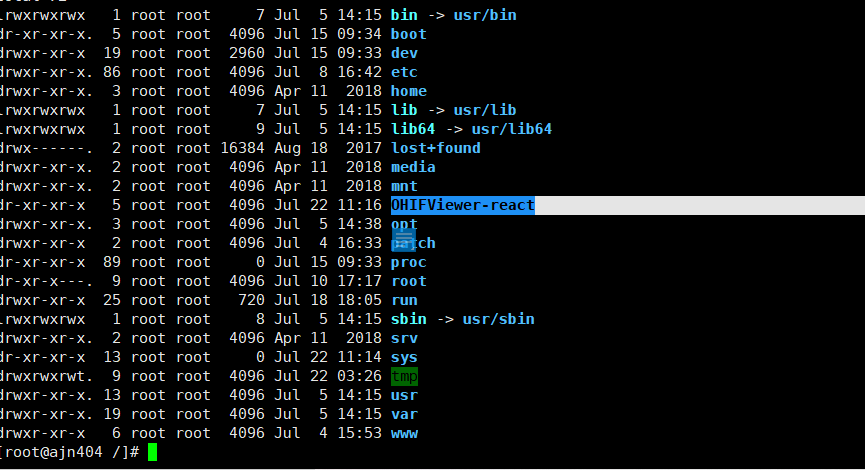
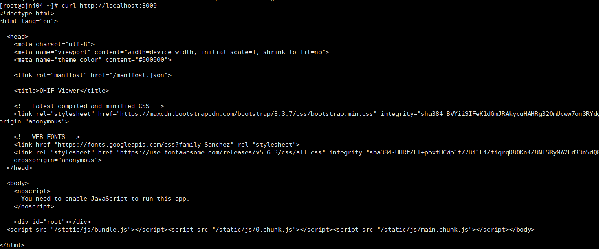

1. 服务器使用 OHIF-REACT

   - 首先将文件上传

     

   - npm install

   - npm start

   - curl http://localhost:3000

     

   ```html
   <!DOCTYPE html>
   <html lang="en">
     <head>
       <meta charset="utf-8" />
       <meta
         name="viewport"
         content="width=device-width, initial-scale=1, shrink-to-fit=no"
       />
       <meta name="theme-color" content="#000000" />

       <link rel="manifest" href="/manifest.json" />

       <title>OHIF Viewer</title>

       <!-- Latest compiled and minified CSS -->
       <link
         rel="stylesheet"
         href="https://maxcdn.bootstrapcdn.com/bootstrap/3.3.7/css/bootstrap.min.css"
         integrity="sha384-BVYiiSIFeK1dGmJRAkycuHAHRg32OmUcww7on3RYdg4Va+PmSTsz/K68vbdEjh4u"
         crossorigin="anonymous"
       />

       <!-- WEB FONTS -->
       <link
         href="https://fonts.googleapis.com/css?family=Sanchez"
         rel="stylesheet"
       />
       <link
         rel="stylesheet"
         href="https://use.fontawesome.com/releases/v5.6.3/css/all.css"
         integrity="sha384-UHRtZLI+pbxtHCWp1t77Bi1L4ZtiqrqD80Kn4Z8NTSRyMA2Fd33n5dQ8lWUE00s/"
         crossorigin="anonymous"
       />
     </head>

     <body>
       <noscript> You need to enable JavaScript to run this app. </noscript>

       <div id="root"></div>
       <script src="/static/js/bundle.js"></script>
       <script src="/static/js/0.chunk.js"></script>
       <script src="/static/js/main.chunk.js"></script>
     </body>
   </html>
   ```

2. node
