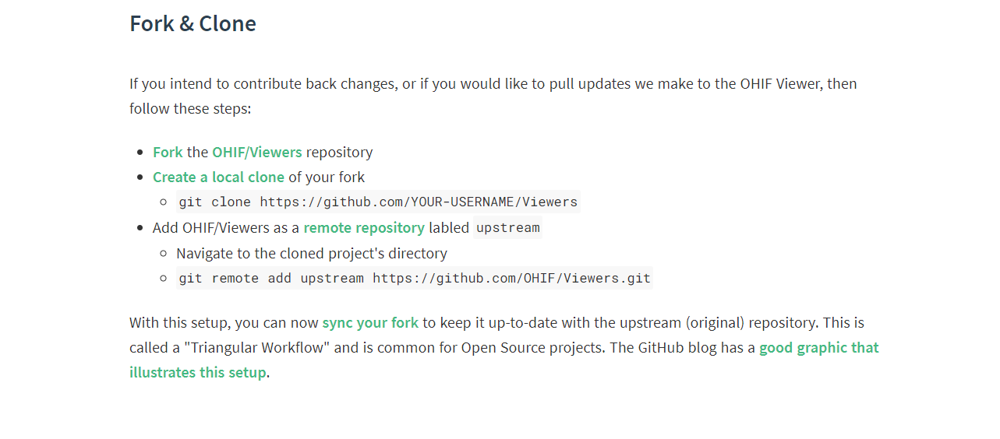

<div align="center">
  <h1>Assistant-decision-making-system-for-gallbladder-cancer</h1>
  <p><strong>胆囊癌辅助决策系统</strong> 是作为本科生的我第一次接触项目,和三位同样是本科生的唐周杨,以及三位研究生大佬,一起正在make的项目 </p>
</div>


### 研究目标和研究内容

​	利用最新的深度学习人工智能技术，结合新华医院的胆道肿瘤大规模样本/患者的多级数据资源，研究人工智能支撑胆道疾病临床诊断的关键技术和智能辅助决策模型，构建胆道肿瘤软件分析平台，提供智慧、精准的辅助决策支持。实现从原始数据输入，各种异构数据类型整合，结合医生的临床经验以及知识，到模型输出结果完全智能化，有望实现胆道肿瘤的早期发现，改善胆道肿瘤“发现即恶性”的现状，进一步提升患者生存率和生存质量。


### 开发

#### 先决条件

**工具篇**

- 首先你需要一个编辑器,推荐使用vscode,下载地址https://code.visualstudio.com/

  vscode容易上手,扩展多,支持语言也多

- 编译Orthanc源码,

  1.使用cmake,注意Orthanc官方下载的源码解压后会有很多没有类型的文件,没有类型是因为没有写后缀,重命名后加后缀.md,用typra(或者直接用vscode,有markdown文件预览插件)打开,这样就能得到详细的说明文件

  关于cmake,下载https://cmake.org/download/了解https://www.jianshu.com/p/bbf68f9ddffa

  2.如果是Windows可以直接在官网上下载[orthanc](https://www.orthanc-server.com/download-windows.php)

- 下载git,chrome(推荐使用,不过你说你要是用firefox也行),python(增加后台图像算法用例,推荐使用python3,虽然咱也不怎么会算法,甚至后台的逻辑咱暂时也没有想明白),node(因为要是npm下载包)

**命令篇**

1. docker  用于本地运行Orthanc,viewer中yarn run dev:orthanc

   例如运行命令

   ```
   docker run -p 4242:4242 -p 8042:8042 --rm jodogne/orthanc
   ```

   将orthanc映射至本地4242或者8042端口,打开http://127.0.0.1:4242/

2. node npm最好配置国内镜像源

   例如

   ```bash
   npm config set registry https://registry.npm.taobao.org
    
   // 配置后可通过下面方式来验证是否成功
   npm config get registry
   ```

   之后就可以前端(成员)就可以照着[文档](https://docs.ohif.org/development/testing.html)改改语言,配色,工具列表等

   viewer[官方文档](https://avatars1.githubusercontent.com/u/45917384?s=460&v=4)
   
   

### 部署

我这里暂时只有一个小方案,在==根目录/docker-compose-sample==

启动

```
docker -compose up
```

依赖:

- nginx.conf

- orthanc.json

- viewer.js

  注:

  之后我们如果能够自己publish到docker hub上自己适配后的代码,改掉viewer.js就可以很容易地部署了


### 测试


### Bug log


### 贡献者

<table><td align="center"><a href="https://github.com/ajn404"><br /><sub><b>ajn404</b></sub></a><br /><a href="https://github.com/OHIF/react-viewerbase/commits?author=swederik" title="Code">💻</a> <a href="#maintenance-swederik" title="Maintenance">🚧</a></td><td align="center"><a href="https://github.com/dc-97"><br /><sub><b>dc-97</b></sub></a><br /><a href="https://github.com/OHIF/react-viewerbase/commits?author=swederik" title="Code">💻</a> <a href="#maintenance-swederik" title="Maintenance"></a></td>
    <td align="center"><a href="https://github.com/dc-97"><br /><sub><b>DouWeiba</b></sub></a><br /><a href="https://github.com/OHIF/react-viewerbase/commits?author=swederik" title="Code">💻</a> <a href="#maintenance-swederik" title="Maintenance"></a></td></table>

### 如何贡献?


**git分支操作流程如下:**

1. fork 上游仓库例如https://github.com/OHIF/Viewers

   fork至自己的github仓库https://github.com/ajn404/Viewers
   (前提是你已经注册并登录了自己的github,就像我的账号是[ajn404](https://github.com/ajn404))

2. git clone https://github.com/ajn404/Viewers,创建本地文件夹,称为本地库

3. 本地创建分支dev(该分支用于开发你的远程库):添加并切换到分支git checkout -b div;或者首先添加分支git branch dev 然后切换到分支git checkout dev

4. 创建upstream分支用于同步上游库,用来同步其他人对上游仓库的更改:git remote add upstream https://github.com/OHIF/Viewers

   注:可以使用git remote -v 查看具体关联库

5. 同步上游仓库:git remote update upstream

   ​						git rebase upstream/main

6. git add *

   git commit -m "你的修改内容记录"

   git push origin dev

   以上就是将你的更改同步到你自己fork的远程库的代码

7. 之后点击new pull request 就可以等待我review你的代码后merge入上游仓库了

8. 之后就是我的事情了

[git操作图解](https://github.com/ajn404/web_developer_daily/blob/main/git/gitcheatsheet.png?raw=true)	

**reference:**
[github:](https://docs.github.com/en)
知乎: [图文详解如何利用Git+Github进行团队协作开发](https://zhuanlan.zhihu.com/p/23478654)

- 关于第五步,也可以直接使用git pull upstream main
- 有什么不懂的可以在issues里讨论
- git command --help也不失为良策


### embedded examples

https://tprch.csb.app/

### 许可证

**MIT**

